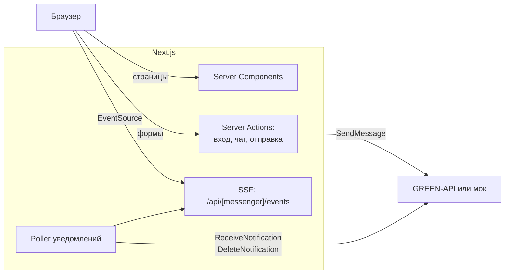
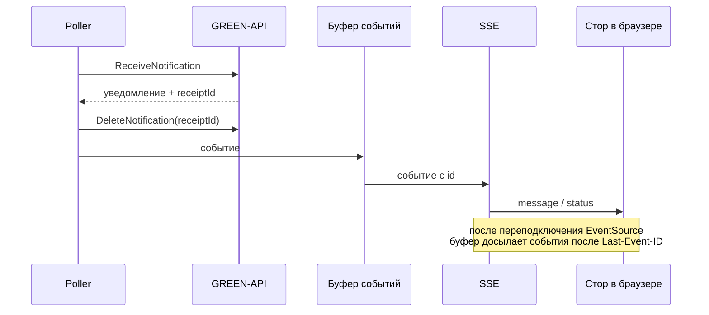
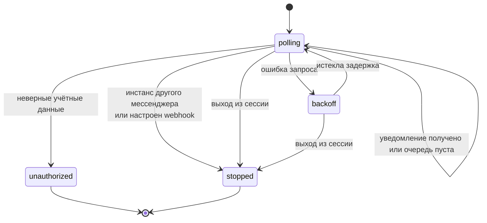

# Multi Messenger

Веб-клиент для отправки и получения текстовых сообщений через [GREEN-API](https://green-api.com/) в трёх мессенджерах: MAX, WhatsApp и Telegram. Постановка — [docs/test-assignment.md](docs/test-assignment.md).

- Вход по `idInstance` и `apiTokenInstance`, у каждого мессенджера свой инстанс и свой вход.
- Создание чата по номеру телефона, отправка сообщений (`SendMessage`), получение через HTTP API (`ReceiveNotification` + `DeleteNotification`).
- Демо-режим работает с локальным моком GREEN-API и не требует аккаунта. Реальный режим включается переменной `REAL_MODE_ENABLED`.

Стек: Next.js (App Router, standalone), React 19, TypeScript, XState, iron-session, pino.

## Архитектура

Браузер не обращается к GREEN-API напрямую: `apiTokenInstance` хранится только в зашифрованной httpOnly-cookie сессии и используется на сервере.



### Поток уведомлений

На каждую сессию мессенджера работает один poller. Каждое полученное уведомление удаляется из очереди до обработки, иначе GREEN-API отдаёт его повторно.



### Состояния poller-а



Задержка в `backoff` растёт экспоненциально с джиттером до 30 секунд; при ответе 429 используется `Retry-After`.

## Локальный запуск

Нужны Node.js 24 и pnpm (версия зафиксирована в `packageManager`, удобно через `corepack enable`).

```bash
pnpm install
cp .env.example .env   # заполнить SESSION_SECRET: openssl rand -base64 32
pnpm mock              # мок GREEN-API на http://localhost:3100
pnpm dev               # в соседнем терминале, http://localhost:3000
```

Запуск в Docker так же, как на сервере:

```bash
docker compose up -d --build --wait   # приложение на 127.0.0.1:${APP_PORT}
```

## Проверки

```bash
pnpm lint
pnpm typecheck
pnpm test
pnpm knip
pnpm build
pnpm test:e2e
```

`pnpm test:e2e` сам поднимает мок и приложение. Чтобы прогнать e2e против уже запущенного стека (например, `docker compose`), задайте `E2E_BASE_URL`.

## Переменные окружения

| Имя                  | Где задаётся                      | Назначение                                                                | По умолчанию                                          |
| -------------------- | --------------------------------- | ------------------------------------------------------------------------- | ----------------------------------------------------- |
| `SESSION_SECRET`     | `.env`                            | Ключ шифрования cookie сессии, не короче 32 символов                      | нет, обязательна                                      |
| `REAL_MODE_ENABLED`  | `.env`                            | Разрешает вход с реальными инстансами GREEN-API                           | `false`                                               |
| `GREEN_API_MOCK_URL` | `.env`, в compose — `environment` | Адрес мока для демо-режима                                                | `http://localhost:3100`, в compose `http://mock:3100` |
| `LOG_LEVEL`          | `.env`                            | Уровень логов pino                                                        | `info`                                                |
| `APP_PORT`           | `.env`                            | Порт на `127.0.0.1`, на который compose публикует приложение              | `3200`                                                |
| `BASE_PATH`          | build arg                         | Префикс путей приложения, например `/text-messenger`; задаётся при сборке | пусто                                                 |
| `IMAGE_TAG`          | окружение `docker compose`        | Тег образов; `deploy.sh` подставляет sha коммита                          | `latest`                                              |

При невалидных переменных сервер не стартует, а контейнер не проходит healthcheck.

## Деплой

CI (`.github/workflows/ci.yml`) на каждый pull request и push в `main` гоняет проверки и e2e против `docker compose`. После зелёного CI на `main` workflow CD (`.github/workflows/cd.yml`) собирает образы `ghcr.io/maker27/text-messenger` и `ghcr.io/maker27/text-messenger-mock` с тегами sha и `latest`. Если в репозитории задана переменная `PUBLISH_IMAGES=true`, CD публикует образы в GHCR, копирует на сервер `docker-compose.yml` и `deploy/deploy.sh` и запускает деплой; без неё workflow ограничивается сборкой.

### Подготовка сервера

1. Установить Docker с плагином Compose.
2. Создать каталог деплоя (`DEPLOY_PATH`) и положить в него `.env` по образцу [.env.example](.env.example) с заполненным `SESSION_SECRET` и нужным `APP_PORT`.
3. Добавить публичный ключ деплоя в `authorized_keys` пользователя, от которого идёт деплой; у пользователя должен быть доступ к Docker.
4. Настроить nginx (см. ниже).

Сервер скачивает образы без логина. Новые пакеты GHCR создаются приватными, поэтому первый запуск CD с публикацией опубликует образы, но упадёт на шаге деплоя: сделайте оба пакета публичными (Package settings → Change visibility → Public) и перезапустите workflow CD.

### Environment `production` в GitHub

| Тип        | Имя               | Значение                                            |
| ---------- | ----------------- | --------------------------------------------------- |
| Секрет     | `SSH_HOST`        | Адрес сервера                                       |
| Секрет     | `SSH_USER`        | Пользователь для деплоя                             |
| Секрет     | `SSH_KEY`         | Приватный ключ деплоя                               |
| Секрет     | `SSH_KNOWN_HOSTS` | Строка `known_hosts` сервера (`ssh-keyscan <host>`) |
| Переменная | `PUBLISH_IMAGES`  | `true` включает публикацию образов и деплой         |
| Переменная | `BASE_PATH`       | Префикс путей, например `/text-messenger`           |
| Переменная | `DEPLOY_PATH`     | Каталог деплоя на сервере                           |

### Откат

`deploy.sh` перезапускает стек на образах нужного sha и до 60 секунд ждёт ответа `/api/health`. Образы берутся из локального хранилища Docker на сервере, а если их там нет — скачиваются из GHCR; на сервере они не собираются. Поэтому откат возможен, только пока образы предыдущего sha есть на сервере или опубликованы: не удаляйте их через `docker image prune -a`. Успешный sha записывается в `.deployed-sha`. Если новая версия не поднялась, скрипт возвращает предыдущий sha из `.deployed-sha`, проверяет его здоровье и завершается с ошибкой, так что workflow CD падает.

Ручной деплой или откат на любой опубликованный sha — из каталога деплоя:

```bash
./deploy.sh <полный-sha-коммита> /text-messenger
```

### nginx

Пример конфигурации — [deploy/nginx.conf.example](deploy/nginx.conf.example). Для `/api/` отключена буферизация (`proxy_buffering off`) и увеличен `proxy_read_timeout`: иначе nginx копит события SSE в буфере и сообщения приходят с задержкой, а долгие соединения обрываются. Заголовок `X-Forwarded-For` перезаписывается адресом клиента, чтобы лимит попыток входа нельзя было обойти подменой заголовка. В access-лог не пишутся IP и query-строка.

## Ограничения

Приложение рассчитано на один экземпляр: poller-ы, буферы уведомлений и лимиты входа живут в памяти процесса. Горизонтальное масштабирование и несколько реплик не поддерживаются, после перезапуска клиенты переподключаются, а poller-ы стартуют заново.
