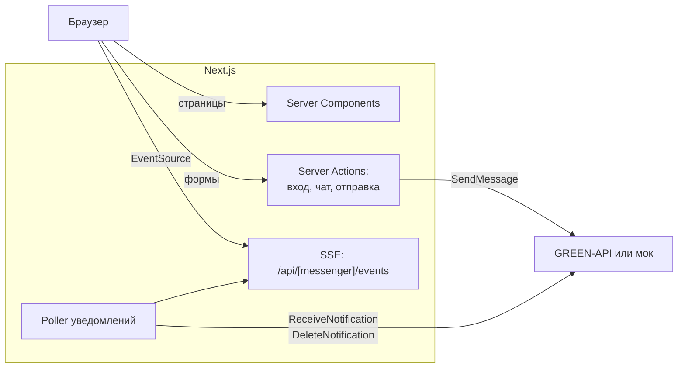
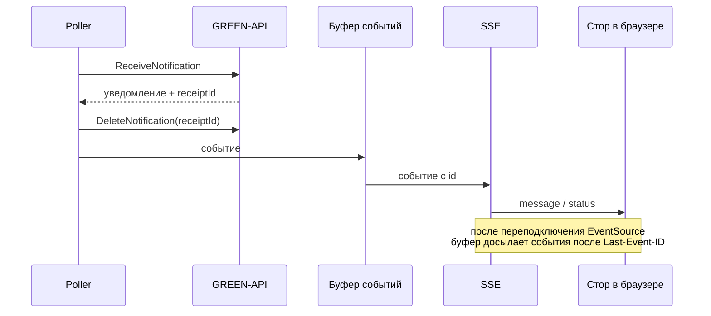
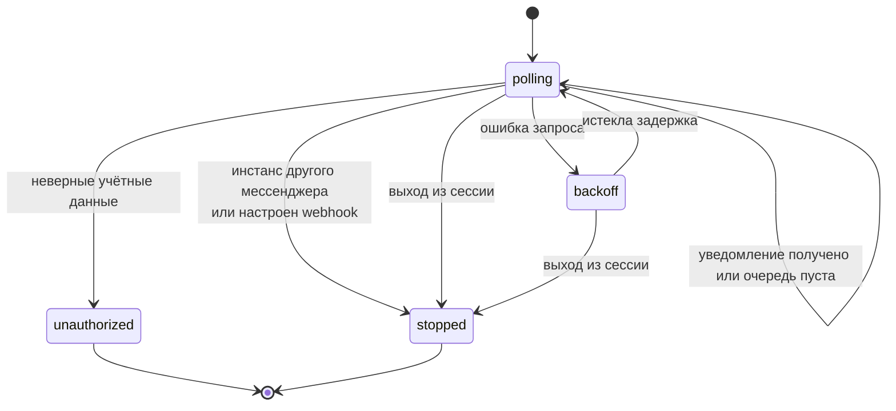

# Multi Messenger


Веб-клиент для переписки через [GREEN-API](https://green-api.com/) в MAX, WhatsApp и Telegram. Постановка задачи — в [docs/test-assignment.md](docs/test-assignment.md).

Что умеет:

- входить по `idInstance` и `apiTokenInstance`, отдельно в каждый мессенджер;
- создавать чат по номеру телефона;
- отправлять и получать текстовые сообщения.

Без аккаунта GREEN-API можно попробовать демо-режим: он работает с локальным моком.

Стек: Next.js (App Router), React 19, TypeScript, XState, iron-session, pino.

## Как подключить свой инстанс

1. Создайте инстанс в [личном кабинете GREEN-API](https://console.green-api.com/) и авторизуйте его.
2. В настройках инстанса включите получение входящих сообщений и оставьте пустым URL webhook: приложение забирает уведомления само.
3. Чтобы видеть статусы «доставлено» и «прочитано», включите ещё уведомления об исходящих сообщениях и их статусах.
4. Запустите приложение с `REAL_MODE_ENABLED=true` и войдите с `idInstance`, `apiTokenInstance` и `apiUrl` из личного кабинета.

Один инстанс — это один мессенджер. В MAX чат можно создать только с российским или белорусским номером: так работает GREEN-API.

## Как это устроено

Браузер не ходит в GREEN-API напрямую. Токен лежит в зашифрованной httpOnly-cookie, запросы делает сервер.



### Поток уведомлений

Для каждой сессии работает один poller. Он забирает уведомление, сразу удаляет его из очереди и передаёт в браузер через SSE.



### Состояния poller-а



При ошибках пауза растёт до 30 секунд. Если GREEN-API ответил 429, poller ждёт столько, сколько указано в `Retry-After`.

## Локальный запуск

Понадобятся Node.js 24 и pnpm (проще всего через `corepack enable`).

```bash
pnpm install
cp .env.example .env   # SESSION_SECRET: openssl rand -base64 32
pnpm mock              # мок GREEN-API, http://localhost:3100
pnpm dev               # в соседнем терминале, http://localhost:3000
```

Или в Docker, как на сервере:

```bash
docker compose up -d --build --wait
```

## Проверки

```bash
pnpm lint
pnpm typecheck
pnpm test
pnpm knip
BASE_PATH=/text-messenger pnpm build
pnpm test:e2e
```

E2E-тесты сами поднимают мок и приложение. Чтобы прогнать их против уже запущенного стека, задайте `E2E_BASE_URL`.

Дополнительно:

| Команда              | Что делает                                                             |
| -------------------- | ---------------------------------------------------------------------- |
| `pnpm test:coverage` | Покрытие, порог 90% строк для `src/server` и `src/entities`            |
| `pnpm size`          | Бюджет клиентского JS, после сборки                                    |
| `pnpm storybook`     | Компоненты в темах трёх мессенджеров, http://localhost:6006            |
| `pnpm lighthouse`    | Lighthouse в демо-режиме, после `BASE_PATH=/text-messenger pnpm build` |
| `pnpm test:visual`   | Скриншотные тесты, только против `docker compose`                      |
| `pnpm showcase`      | Записывает демо и собирает GIF, после сборки; нужен `ffmpeg`           |

Эталонные скриншоты снимаются в Docker-образе Playwright. После намеренных изменений интерфейса обновите их: `pnpm test:visual --update-snapshots`.

## Переменные окружения

| Имя                  | Где задаётся                      | Назначение                                                                | По умолчанию                                          |
| -------------------- | --------------------------------- | ------------------------------------------------------------------------- | ----------------------------------------------------- |
| `SESSION_SECRET`     | `.env`                            | Ключ шифрования cookie сессии, не короче 32 символов                      | нет, обязательна                                      |
| `REAL_MODE_ENABLED`  | `.env`                            | Разрешает вход с реальными инстансами GREEN-API                           | `false`                                               |
| `GREEN_API_MOCK_URL` | `.env`, в compose — `environment` | Адрес мока для демо-режима                                                | `http://localhost:3100`, в compose `http://mock:3100` |
| `LOG_LEVEL`          | `.env`                            | Уровень логов pino                                                        | `info`                                                |
| `APP_PORT`           | `.env`                            | Порт на `127.0.0.1`, на который compose публикует приложение              | `3200`                                                |
| `BASE_PATH`          | build arg                         | Префикс путей приложения, например `/text-messenger`; задаётся при сборке | пусто                                                 |
| `IMAGE_TAG`          | окружение `docker compose`        | Тег образов; `deploy.sh` подставляет sha коммита                          | `latest`                                              |

С невалидными переменными сервер не стартует.

## Деплой

CI проверяет каждый pull request и push в `main`. После зелёного CI на `main` CD собирает образы `ghcr.io/maker27/text-messenger` и `ghcr.io/maker27/text-messenger-mock`. Публикация и выкладка на сервер включаются переменной `PUBLISH_IMAGES=true`.

### Подготовка сервера

1. Установите Docker с плагином Compose.
2. Создайте каталог деплоя и положите туда `.env` по образцу [.env.example](.env.example).
3. Добавьте публичный ключ деплоя пользователю с доступом к Docker.
4. Настройте nginx по примеру [deploy/nginx.conf.example](deploy/nginx.conf.example). Для `/api/` в нём отключена буферизация, иначе сообщения через SSE приходят с задержкой.

Новые пакеты в GHCR создаются приватными, а сервер скачивает образы без логина. Поэтому первый деплой упадёт: сделайте оба пакета публичными и перезапустите CD.

### Environment `production` в GitHub

| Тип        | Имя               | Значение                                            |
| ---------- | ----------------- | --------------------------------------------------- |
| Секрет     | `SSH_HOST`        | Адрес сервера                                       |
| Секрет     | `SSH_USER`        | Пользователь для деплоя                             |
| Секрет     | `SSH_KEY`         | Приватный ключ деплоя                               |
| Секрет     | `SSH_KNOWN_HOSTS` | Строка `known_hosts` сервера (`ssh-keyscan <host>`) |
| Переменная | `PUBLISH_IMAGES`  | `true` включает публикацию образов и деплой         |
| Переменная | `BASE_PATH`       | Префикс путей, например `/text-messenger`           |
| Переменная | `DEPLOY_PATH`     | Каталог деплоя на сервере                           |

### Откат

`deploy.sh` поднимает стек на образах нужного коммита и ждёт ответа `/api/health` до 60 секунд. Если новая версия не поднялась, скрипт возвращает предыдущую и завершается с ошибкой.

Откатиться можно на любой коммит, образы которого опубликованы или остались на сервере. Поэтому не чистите их через `docker image prune -a`.

```bash
./deploy.sh <полный-sha-коммита> /text-messenger
```

## Ограничения

Приложение работает в одном экземпляре: poller-ы, буферы и лимиты входа хранятся в памяти процесса. После перезапуска клиенты переподключаются сами.
